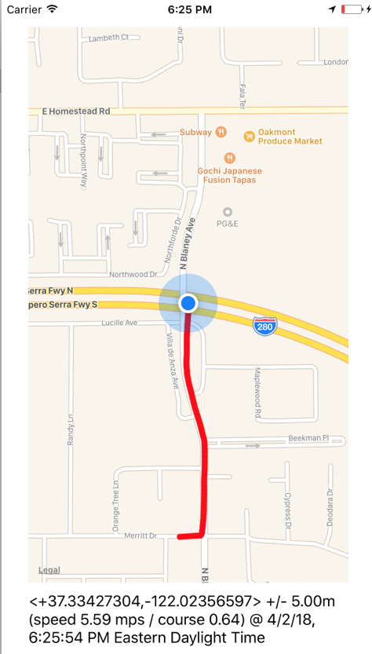

# User-Tracking-App

I created an iOS app to track a user as they move around the city.  The app uses Polylines and real-time location tracking to find the user’s position and draw their path.
## Technologies:
- Swift
- XCode
- CoreLocation Framework
- Polylines

## Screenshots

